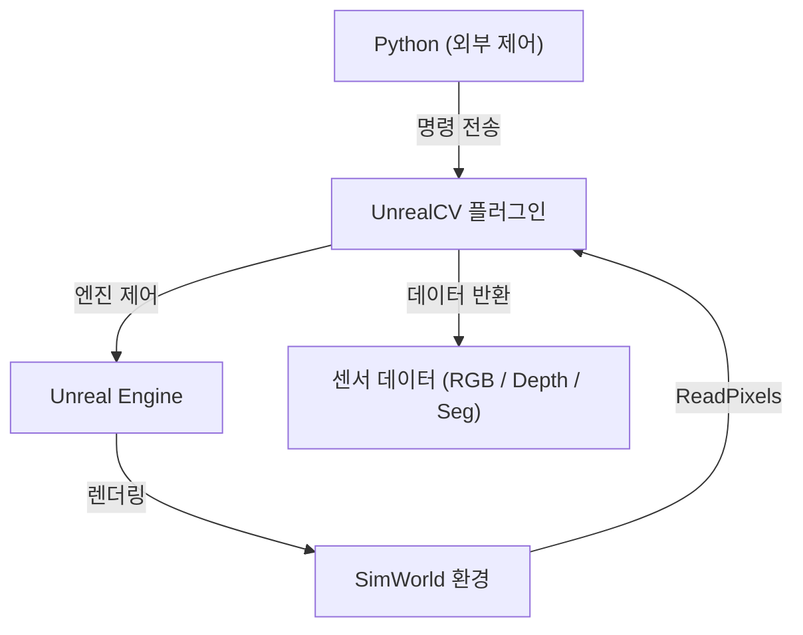

* TOC
{:toc}

---

## 1. SimWorld 개요

자율주행/로봇 개발에서 실환경 테스트 전 시뮬레이터는 사실상 필수다.  
그 선택지 중 하나가 **SimWorld**인데, Unreal Engine 기반의 자율주행 시뮬레이션 플랫폼으로 고해상도 렌더링과 커스텀 Asset 지원을 내세운다.  

 
한 가지 먼저 짚고 넘어가야 할 점이 있다.

> **SimWorld는 "로봇을 제공하는 플랫폼"이 아니라 "환경을 제공하는 플랫폼"이다.**  
> 처음에 이 부분을 흐릿하게 이해한 채 진입하면 시간이 꽤 날아간다.

이 글은 SimWorld를 실제로 적용하면서 마주친 구조적 특징과 한계를 정리한 기록이다.  
특히 **"미리 알았으면 좋았을"** 부분에 초점을 맞췄다.

---

## 2. 전체 구조: SimWorld + UnrealCV

SimWorld는 독립적인 시스템이 아니다. 내부적으로 **UnrealCV 플러그인**에 의존한다.

**SimWorld = Unreal Engine + UnrealCV + Python 인터페이스**

### UnrealCV란
Unreal Engine에서 컴퓨터 비전 연구용으로 만들어진 플러그인으로,  
외부(Python 등)에서 엔진 내부로 **카메라 제어 명령을 보내고 RGB/Depth/Segmentation 데이터를 받아오는** 통로 역할을 한다.

> SimWorld의 센서 데이터는 결국 **UnrealCV가 생성한다.**  
> SimWorld를 사용하는 이상 UnrealCV의 인터페이스와 동작 방식을 이해하는 건 선택이 아니다.

아래는 전체 데이터 흐름이다.

---

## 3. 센서 구성 방식: SetCamera vs Custom Asset

SimWorld에서 카메라 센서를 구성하는 방법은 두 가지로 나뉜다.

### 3.1 SetCamera (동적 배치)
런타임에 코드로 카메라를 생성하고 제어하는 방식이다.

> 장점 : 빠른 초기 실험, 위치/각도 유연하게 변경 가능  
> 단점 : 카메라 간 Extrinsics(위치 관계) 정밀하게 고정하기 어려움

### 3.2 Custom Asset (.pak) 기반 정적 구성
Unreal Editor에서 로봇과 센서 구조를 미리 정의하고 `.pak`으로 패키징해 SimWorld에 올리는 방식이다.  
SimWorld가 [공식적으로 권장](https://simworld.readthedocs.io/en/latest/customization/make_your_own_pak.html)하는 방식이기도 하다.

> 장점 : 센서 간 Extrinsics 고정, 실행 시 항상 동일한 환경 보장  
> 단점 : 수정 비용이 높고, Unreal Engine 작업 환경이 필요함

 
실제 로봇의 센서 배치와 동일한 구성을 유지해야 했기 때문에 **Custom Asset 방식을 선택했다.**  
그리고 여기서 예상치 못한 구조적 문제가 드러났다.

---

## 4. Known Issue: 다중 카메라 FPS 급락

Custom Asset 기반으로 카메라를 여러 개 구성했을 때 성능이 심각하게 저하된다.

| 구성 | FPS |
|---|---|
| 단일 카메라 | 약 20~25 FPS |
| 카메라 7개 | 약 2~5 FPS |

카메라 수 증가에 따라 **선형이 아닌 급격한 성능 저하**가 발생한다.

### 원인

핵심은 UnrealCV의 `ReadPixels()` 호출이 **동기(Synchronous)** 방식으로 수행된다는 것이다.  
*(내부 코드를 직접 디버깅할 수 없어 외부에서 추적한 결과이므로, 이 이상의 분석은 한계가 있다.)*

카메라 수만큼 이 사이클이 **직렬로 누적**되면서 병목이 쌓인다.  
병렬 처리 구조가 없기 때문에, 카메라가 늘어날수록 프레임 드랍이 필연적이다.

### 구조적 한계

> 이 문제는 단순 설정 문제가 아니라 **UnrealCV 데이터 수집 구조(Architecture) 자체의 한계**다.  
> SimWorld 내부를 직접 수정할 수 없기 때문에, 우리 쪽에서 해결할 수 있는 방법이 없다.

[SimWorld GitHub Issue #86](https://github.com/SimWorld-AI/SimWorld/issues/86)에 관련 문제를 보고해 두었고, 답변을 기다리는 중이다.  
오픈소스인 만큼 내부 구조 변경에는 한계가 있고, 해결까지 시간이 걸릴 수 있다.

---

## 5. 정리

SimWorld + UnrealCV 구조에서 실제 적용 시 알아야 할 핵심 포인트다.

1. SimWorld는 **환경 제공 도구**다. 로봇 자체는 별도로 구성해야 한다.
2. 센서 데이터는 **UnrealCV를 통해 생성**된다. 이 구조를 모르면 SimWorld 자체를 이해하기 어렵다.
3. **다중 카메라 구성 시 FPS가 구조적으로 급락**한다. 설정 문제가 아니라 Architecture 한계다.
4. Custom Asset 방식을 제대로 활용하려면 **Unreal Engine 기초 지식이 필요**하다.

 
결론 — SimWorld를 쓰고자 한다면 Unreal Engine에 대한 사전 이해가 필요하고,  
멀티 카메라 구성이 필수인 환경이라면 현시점에서 대안 시뮬레이터와 병행 검토를 권장한다.

---
