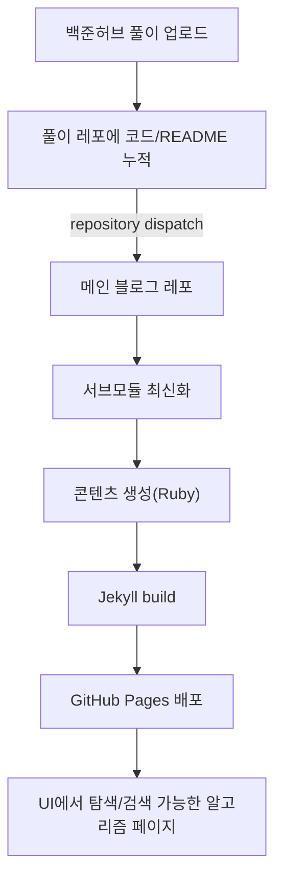

* TOC
{:toc}

---

## 1. 백준 허브? 그게 뭔데, 이건 왜 하는건데..?
알고리즘을 하기위해 여기저기를 돌아봤던 사람이라면 아마 '백준허브' 가 무엇인지는 알고 있을 것이다.  
단순하게 말하자면, 알고리즘 문제풀이를 내 github에 올릴 수 있도록 해주는 Google Extension이고,  
조금 있어보이게 말하자면, 문제 풀이 과정을 커밋 단위로 축적해주는 ‘자동화된 파이프라인' 이다.  

혹시, 지금 이 글을 보고 처음 알게되었다면 '[백준허브 Git-Hub](https://github.com/BaekjoonHub/BaekjoonHub?tab=readme-ov-file)'를 보신 뒤,  
[구글 익스텐션](https://chromewebstore.google.com/detail/%EB%B0%B1%EC%A4%80%ED%97%88%EB%B8%8Cbaekjoonhub/ccammcjdkpgjmcpijpahlehmapgmphmk)으로 한 번 설치 해서 써보면 어떤 느낌인지 확실히 알 것이다.

 
나름 문제를 열심히 풀 던 사람으로서, 그리고 수집하는 것을 좋아하는 사람으로서, 푼 것들을 한 번씩 구경하는데, 
이거 여간 불편한게 아니다. 그래서 구글에 Velog로 정리를 하는 사람들을 보면, "엄청 부럽고 멋지다" 라는 생각을 하는 와중에,  "그냥 백준허브랑 연동해서 View만 하면 되는거 아니야?" 라는 생각이 문득 스쳐지나갔다.

 
이 때부터 자기합리화가 참 무서운게, 

> 마침 '블꾸'도 하고 있고  
> 뭔가 연동하면 멋있을 것 같고 
> 알고풀이도 주석으로 정리하면 되고 

안할 이유가 없는게 아니겠는가? 
그래서 무작정 하기 시작했다. (지옥의 시작이란 것을 알지 못한 채...) 
그래도 걱정 말자! 이걸 보고 "어 나도 하고싶은데?" 하는 사람들은 *이걸 보거나 (AI를 쓰거나)* 하시면 됩니다.

## 2. 어떤식으로 돌아가게 해야하나?

큰 틀은 아주 쉽다. 
1. GitHub.io에 백준 허브 레포를 Submodule로 설정한다.
2. 백준 허브 레포에 이벤트를 Trigger 시킬 Action을 만들어둔다 
3. GitHub.io 에 해당 Trigger를 감지할 Action을 만들어둔다
4. 감지가 되면 fetch > pull > 문제.md 생성 > deploy 를 한다

**(악마 曰 : 간단하쥬?)**

 

아래는 "위 플로우에 대한" 만든 **전체 흐름도다.**

이제 여기서 열심히 우리가 알고리즘에서 배웠던, ~~recursion 을 사용하면 된다.~~  
나는 코드 하수라, 3Depth를 직접 파고 들어갔다 ㅜㅜㅜ   
이제는 설정에 대해서 이야기 할 수 있도록 하겠다.

## 3. 예고
짜잔! 설정에 대해서 이야기를 하고 싶지만, 글이 길어지는 관계로 뒤로 미루기로 했다.

여기까지는 “왜" 와, "어떻게" 만 짚었다.  
이번에 다 설명하고 싶었지만,, 코드·YAML이 주렁주렁 붙기 시작해서, **파트 (2)**에서 아래 순서로 정리해두려고 한다.

1. **서브모듈 연결** 
    - `.gitmodules`로 `modules/Algorithm`이 `study_algorithm` 레포를 가리키게 두고, 메인 레포는 “참조 + 빌드” 수행
2. **풀이 레포 → 메인 레포 Trigger** 
    - `study_algorithm` 쪽 GitHub Actions에서 `repository_dispatch`로 메인 레포에 `submodule-updated` 이벤트를 Triggering, 그리고 환경 (`MAIN_REPO_TOKEN` 등) 설정
3. **메인 레포에서 서브모듈 최신화** 
    - `update-submodule.yml`: `modules/Algorithm`에서 `fetch` 후 로컬과 원격 커밋 비교, 필요할 때만 `submodule update --remote` 후 커밋·푸시하는 흐름, 그리고 **스케줄/수동 실행**
4. **빌드·배포** 
    - `jekyll.yml`: 서브모듈 체크아웃 포함 → Ruby 스크립트로 `_algorithm/**`·`_data/sidebar.yml` 생성 → `jekyll build` → GitHub Pages 배포
5. **“문제.md” 생성** 
    - `scripts/generate_*.rb` 다섯 개가 각각 맡은 일(알고 메인 / 플랫폼·티어 목록 / 문제 상세 README+코드 / 사이드바)
6. **현재 막힌 부분** 
    - 계속해서 나를 괴롭히는 GitHub Actions..

(2)에서는 위 항목을 **설명 위주 + 필요한 코드/YAML 조각만** 떼어서 붙이겠다. 같은 구조로 따라 하고 싶은 사람은 Part 2만 모아도 체크리스트처럼 쓸 수 있게 맞춰볼 예정이다.