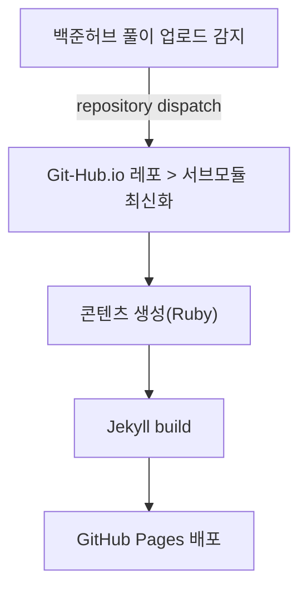

* TOC
{:toc}

---

## 1. 이전까지의 요약.

알고리즘을 풀면 자동으로 글을 만들어주는 친구를 만들고싶어!!  
우리 함께 사서 고생을 해보자!  

**내 고생의 흐름**은 아래와 같다.

 "알고리즘 풀이 감지 후, 업로드 하기" 를 기반으로

와 같이 수행한다.

저번 글에서 "왜, 어떻게"를 이야기 했으니,  
"이렇게 했다" 를 이야기 할 차례가 온 것 같다.  
이제는 "이렇게 했어요 ㅠㅠ" 를 주제로 이야기 할 수 있도록 하겠다.

## 2. 백준허브에서 Readme.md 를 어떻게 가지고 올껀데?
짜잔! 설정에 대해서 이야기를 하고 싶지만, 글이 길어지는 관계로 뒤로 미루기로 했다.

여기까지는 “왜" 와, "어떻게" 만 짚었다.  
이번에 다 설명하고 싶었지만,, 코드·YAML이 주렁주렁 붙기 시작해서, **파트 (2)**에서 아래 순서로 정리해두려고 한다.

1. **서브모듈 연결** 
    - `.gitmodules`로 `modules/Algorithm`이 `study_algorithm` 레포를 가리키게 두고, 메인 레포는 “참조 + 빌드” 수행
2. **풀이 레포 → 메인 레포 Trigger** 
    - `study_algorithm` 쪽 GitHub Actions에서 `repository_dispatch`로 메인 레포에 `submodule-updated` 이벤트를 Triggering, 그리고 환경 (`MAIN_REPO_TOKEN` 등) 설정
3. **메인 레포에서 서브모듈 최신화** 
    - `update-submodule.yml`: `modules/Algorithm`에서 `fetch` 후 로컬과 원격 커밋 비교, 필요할 때만 `submodule update --remote` 후 커밋·푸시하는 흐름, 그리고 **스케줄/수동 실행**

## 3. 가지고 온 것을 어떻게 .md 형태로 만들껀데??

3. **메인 레포에서 서브모듈 최신화** 
    - `update-submodule.yml`: `modules/Algorithm`에서 `fetch` 후 로컬과 원격 커밋 비교, 필요할 때만 `submodule update --remote` 후 커밋·푸시하는 흐름, 그리고 **스케줄/수동 실행**
4. **빌드·배포** 
    - `jekyll.yml`: 서브모듈 체크아웃 포함 → Ruby 스크립트로 `_algorithm/**`·`_data/sidebar.yml` 생성 → `jekyll build` → GitHub Pages 배
5. **“문제.md” 생성** 
    - `scripts/generate_*.rb` 다섯 개가 각각 맡은 일(알고 메인 / 플랫폼·티어 목록 / 문제 상세 README+코드 / 

## 4. 아니 이거 왜 안되는건데...

6. **현재 막힌 부분** 
    - 계속해서 나를 괴롭히는 GitHub Actions..