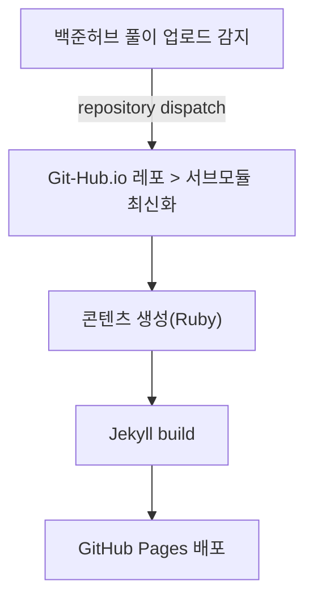

* TOC
{:toc}

---

## 1. 이전까지의 요약.

알고리즘을 풀면 자동으로 글을 만들어주는 친구를 만들고싶어!!<br> 
우리 함께 사서 고생을 해보자! <br>

**내 고생의 흐름**은 아래와 같다.

 "알고리즘 풀이 감지 후, 업로드 하기" 를 기반으로

와 같이 수행한다.

저번 글에서 "왜, 어떻게"를 이야기 했으니, <br>
"이렇게 했다" 를 이야기 할 차례가 온 것 같다. <br>
이제는 "이렇게 했어요 ㅠㅠ" 를 주제로 이야기 할 수 있도록 하겠다.

## 2. 백준허브에서 문제 풀었는것들은 어떻게 가지고 올껀데?
이 문제는, 백준허브에서 "문풀 레포에 올리는 것"을 "github.io 폴더가 감지"를 하게 만들면 된다. <br>
내 github.io 레포의 .github/workflow에 보면, [trigger-main-repo.yml.example](https://github.com/Kimsc9976/Kimsc9976.github.io/blob/main/.github/workflows/trigger-main-repo.yml.example) yml파일이 있다.

이 친구가 백준허브와 연동된 레포의 .github/workflow 안으로 들어가면 끝이다. (사실 끝이 아니다.)<br>
링크에 있는 yml 긁어다 바로 쓰면, 에러가 뜨거나 내 레포에 올라가니 바로 올리는건 지양해주시길...

```
name: Trigger Main Repository Update

on:
  push:
    branches: [main, master]

permissions:
  contents: read

jobs:
  trigger:
    runs-on: ubuntu-latest
    steps:
      - name: Trigger main repository workflow
        uses: peter-evans/repository-dispatch@v3
        with:
          token: ${{ secrets.REPO_DISPATCH_TOKEN }}
          repository: 사용자의 github io 레포지토리 명 
          event-type: submodule-updated
          client-payload: |
            {
              "submodule": "사용할 submodule 이름 ",
              "commit": "$ github.sha ",
              "ref": "$ github.ref "
            }
```
* 이를 위해서 token작업과, sha ref 작업을 하고 해당 repo에 setting > security > secrets and variables을 해야한다.

위 코드는 쉽게 말하자면 "push가 발생"하면, "해당 repo로 trigger를 보내라" 의 역할을 하는 workflow이다.

이렇게 트리거를 보내면 [update-submodule.yml](https://github.com/Kimsc9976/Kimsc9976.github.io/blob/main/.github/workflows/update-submodule.yml)
이 친구가, 해당 트리거를 감지해서 Fetch를 진행하게 된다.

## 3. 가지고 온 것을 어떻게 .md 형태로 만들껀데??

이렇게 만들었으면, 업데이트를 해야하지 않겠는가? submodule로 Fetch를 백날 해봐야 Jekyll이 읽을 `_algorithm/**/index.md`가 없으면 우리가 볼 수가 없다. <br>
그래서 `modules/Algorithm` 아래 폴더 구조를 훑어서 md를 뱉는 친구들을 `scripts/`에 만들었다.<br>
원래는 여기서 열심히 우리가 알고리즘에서 배웠던, ~~recursion 을 사용하려고 했으나....~~ <br>
그런데 너무 귀찮아져서 /사이트 /티어 /문제 로 나누어서 3개를 만들었다... 돌아 가기만 하면 되니까....<br>

각각의 ruby 스크립트는 아래와 같이 동작한다
- 페이지 접근을 위한 Side-bar의 메뉴 생성
- 티어별로 나누어져있으니 티어별로 분리
- 각 티어에 있는 문제들 생성

### 3-1. `generate_algorithm.rb` — `/algorithm/` 허브 페이지
쉽게 말하자면, **플랫폼(사이트)별로 티어 링크 + 최근 풀이 링크**를 모아서 `_algorithm/index.md` 하나를 찍어내는 스크립트다. <br>
한글 경로가 깨지지 않게 `safe_path` / `safe_url_path`로 정리한 뒤, 마지막에 `layout: algorithm`, `permalink: /algorithm/`인 front matter와 카드 HTML을 합쳐서 쓴다.

```ruby
BASE = "modules/Algorithm"
OUT_BASE = "_algorithm"
FileUtils.mkdir_p(OUT_BASE)

def safe_path(str)
  str.unicode_normalize(:nfkc)
     .gsub(/\p{Space}+/, "-")
     .gsub(/[^\w\-\p{Hangul}]/, "")
     .gsub(/-+/, "-").gsub(/^-|-$/, "").downcase
end

def safe_url_path(str)
  URI.encode_www_form_component(safe_path(str))
end

sites = Dir.glob("#{BASE}/*").select { |d| File.directory?(d) }

site_data = sites.map do |site_path|
  site_name = File.basename(site_path)
  tiers = Dir.glob("#{site_path}/*").select { |d| File.directory?(d) }
  tier_names = tiers.map { |t| File.basename(t) }

  recent_problems = tiers.flat_map do |tier|
    Dir.glob("#{tier}/*").select { |p| File.directory?(p) }
  end.sort_by { |p| File.mtime(p) }.reverse.first(3).map do |p|
    tier_name = File.basename(File.dirname(p))
    problem_name = File.basename(p)
    {
      "title" => problem_name,
      "url" => "/algorithm/#{safe_url_path(site_name)}/#{safe_url_path(tier_name)}/#{safe_url_path(problem_name)}/"
    }
  end

  { "site" => site_name, "site_safe" => safe_url_path(site_name),
    "tiers" => tier_names, "tiers_safe" => tier_names.map { |t| safe_url_path(t) },
    "recent" => recent_problems }
end

md = <<~MD
---
layout: algorithm
title: Algorithm Sites
permalink: /algorithm/
---

<div class="algorithm-grid">
#{site_data.map do |site|
  tiers_html = site["tiers"].zip(site["tiers_safe"]).map do |t, t_safe|
    "<li><a href='/algorithm/#{site['site_safe']}/#{t_safe}/'>#{t}</a></li>"
  end.join("\n")
  recent_html = site["recent"].map { |p| "<li><a href='#{p['url']}'>#{p['title']}</a></li>" }.join("\n")
  <<~CARD
  <div class="algo-card">
    <h2>#{site['site']}</h2>
    <h3>Tiers</h3>
    <ul>#{tiers_html}</ul>
    <h3>Recent Problems</h3>
    <ul>#{recent_html}</ul>
  </div>
  CARD
end.join("\n")}
</div>
MD

File.write("#{OUT_BASE}/index.md", md)
```

### 3-2. `generate_tier.rb` — 티어 단위 목록 페이지
`BASE/*/*`로 **플랫폼/티어**까지 내려가서, 그 안의 문제 폴더만 모은다. <br>
문제가 많으면 한 번에 보기 힘드니 `each_slice(20)`으로 끊어서 섹션을 만든다. front matter에는 `layout: tier`, `platform`, `tier`, `permalink: /algorithm/.../`를 넣는다.

```ruby
Dir.glob("#{BASE}/*/*").each do |tier_path|
  next unless File.directory?(tier_path)

  relative_raw = tier_path.sub("#{BASE}/", "")
  relative_parts = relative_raw.split(File::SEPARATOR)
  relative = relative_parts.map { |p| safe_path(p) }.join(File::SEPARATOR)

  out_dir = File.join(OUT_BASE, relative)
  FileUtils.mkdir_p(out_dir)

  problem_dirs = Dir.glob("#{tier_path}/*").select { |p| File.directory?(p) }
  next if problem_dirs.empty?

  groups = problem_dirs.each_slice(20).to_a
  sections = groups.map.with_index do |slice, idx|
    links = slice.map do |p|
      name = File.basename(p)
      safe_url = safe_url_path(name)
      "<li><a href=\"./#{safe_url}/\">#{name}</a></li>"
    end.join("\n")
    <<~HTML
    <h2>#{idx * 20 + 1} ~ #{idx * 20 + slice.size}</h2>
    <ul class="problem-grid collapsed">#{links}</ul>
    HTML
  end.join("\n")

  relative_url = relative_parts.map { |p| safe_url_path(p) }.join("/")
  platform_raw = relative_parts.first
  platform_url = safe_url_path(platform_raw)
  tier_raw = relative_parts[1] || File.basename(relative_raw)
  tier_url = safe_url_path(tier_raw)

  md = <<~MD
  ---
  layout: tier
  title: #{yaml_safe(File.basename(relative_raw))}
  platform: #{yaml_safe(platform_raw)}
  platform_url: #{yaml_safe(platform_url)}
  tier: #{yaml_safe(tier_raw)}
  tier_url: #{yaml_safe(tier_url)}
  permalink: #{yaml_safe("/algorithm/#{relative_url}/")}
  ---

  #{sections}
  MD

  File.write("#{out_dir}/index.md", md)
end
```

(`yaml_safe`는 front matter에 `%` 같은 문자가 들어가도 깨지지 않게 따옴표 처리하는 헬퍼다.)

### 3-3. `generate_problem.rb` — 문제 상세 페이지
**README.md를 본문**으로 쓰고, 지정 확장자 파일을 찾아 **코드 펜스**로 붙인다. <br>
`git log -1`로 README 마지막 커밋 시각을 잡아 `date:`에 넣는 것도 여기서 한다.

````ruby
SRC = "modules/Algorithm"
OUT_BASE = "_algorithm"

LANG_MAP = {
  ".py" => "python", ".cc" => "cpp", ".java" => "java",
  ".sql" => "sql", ".js" => "javascript"
}

def git_last_modified(file_path)
  dir = File.dirname(file_path)
  ts = `cd "#{dir}" && git log -1 --format="%ct" -- "#{File.basename(file_path)}"`.strip
  return Time.at(ts.to_i) if ts != ""
  File.mtime(file_path)
end

Dir.glob("#{SRC}/*").each do |platform_dir|
  next unless File.directory?(platform_dir)
  platform_raw = File.basename(platform_dir)
  platform = safe_path(platform_raw)

  Dir.glob("#{platform_dir}/*").each do |tier_dir|
    next unless File.directory?(tier_dir)
    tier_raw = File.basename(tier_dir)
    tier = safe_path(tier_raw)

    Dir.glob("#{tier_dir}/*").each do |problem|
      next unless File.directory?(problem)
      name_raw = File.basename(problem)
      name = safe_path(name_raw)

      out = File.join(OUT_BASE, platform, tier, name)
      FileUtils.mkdir_p(out)

      readme_path = "#{problem}/README.md"
      readme_content = File.exist?(readme_path) ? File.read(readme_path) : "_No description provided._"
      date = git_last_modified(readme_path)
      code_blocks = []

      LANG_MAP.each do |ext, lang|
        Dir.glob("#{problem}/*#{ext}").each do |file|
          content = File.read(file)
          code_blocks << <<~CODE
          ### 📄 #{File.basename(file)}

          ```#{lang}
          #{content}
          ```
          CODE
        end
      end

      platform_url = safe_url_path(platform_raw)
      tier_url = safe_url_path(tier_raw)
      name_url = safe_url_path(name_raw)

      md = <<~MD
      ---
      layout: problem
      title: #{yaml_safe(name_raw)}
      platform: #{yaml_safe(platform_raw)}
      platform_url: #{yaml_safe(platform_url)}
      tier: #{yaml_safe(tier_raw)}
      tier_url: #{yaml_safe(tier_url)}
      permalink: #{yaml_safe("/algorithm/#{platform_url}/#{tier_url}/#{name_url}/")}
      date: #{date}
      ---

      #{readme_content}

      ## 💡 Solutions

      #{code_blocks.join("\n")}
      MD

      File.write("#{out}/index.md", md)
    end
  end
end
````

(`safe_path` / `safe_url_path` / `yaml_safe`는 위 티어 스크립트와 동일 계열이다.)

사이드바용 `generate_sidebar.rb`나 플랫폼용 `generate_algo_level.rb`도 있지만, **“보이는 페이지의 뼈대”**는 위 세 덩어리로 거의 갖춰진다고 보면 된다. <br>

## 4. 아니 이거 왜 안되는건데...

- Fetch는 되는데,,, 이걸 기반으로 Auto Push가 되지 않는다... 
그런데, 사실, 스케쥴러가 11시에 자동으로 업데이트 해주기 때문에, Fetch만 지금은 Fetch를 하면 스케쥴러로 업데이트를 수행 하는 중이다.